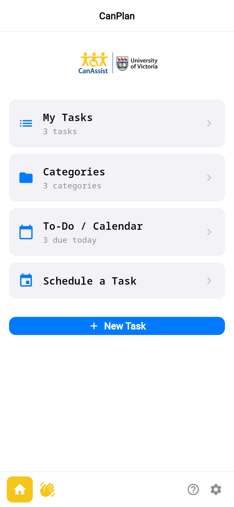
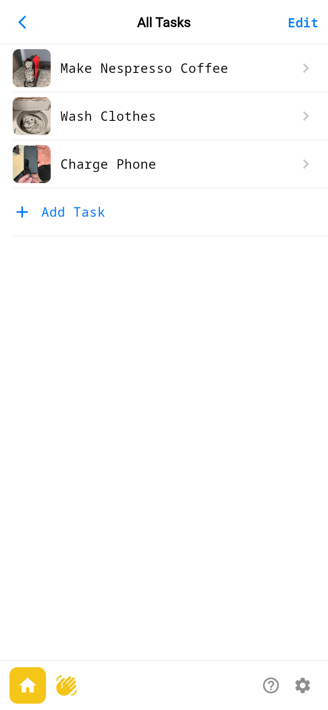
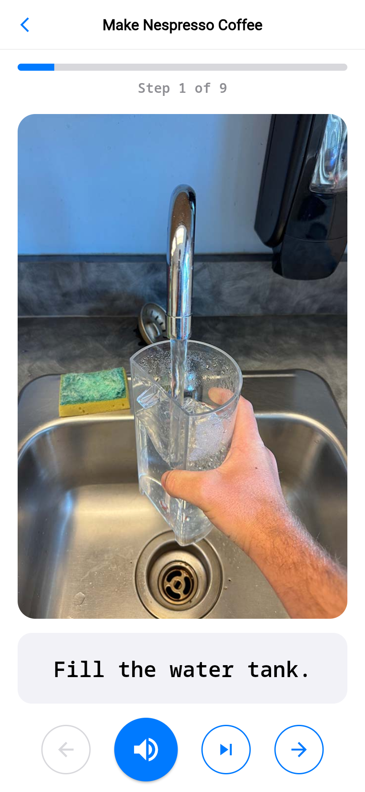
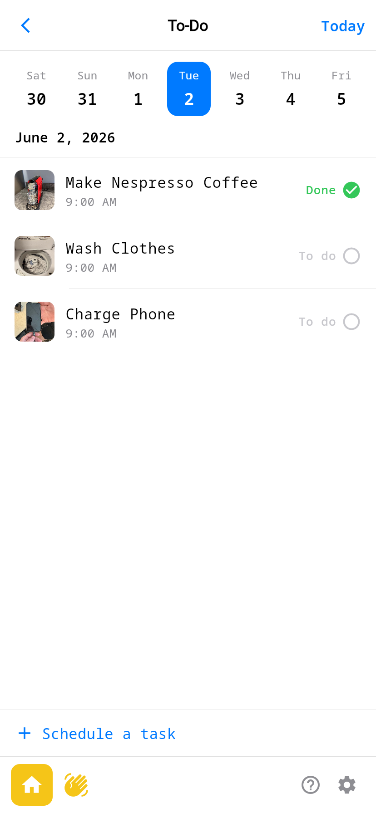

# CanPlan — Flutter UI Skeleton

[](https://github.com/jmpei/canplanv1/actions/workflows/deploy.yml)

A high-fidelity, **UI-only** reconstruction of the **CanPlan** iOS app
(University of Victoria — CanAssist) in Flutter. It reproduces the look and
navigation of the app's core flows with hardcoded sample data, and is structured
so the data layer can later be swapped for a real backend without touching the
screens.

**🔗 Live demo:** https://jmpei.github.io/canplanv1/
*(after enabling Pages — see [Deploy](#deploy) below)*

## Screenshots

<table>
  <tr>
    <td></td>
    <td></td>
    <td></td>
    <td></td>
  </tr>
  <tr>
    <td align="center">Dashboard</td>
    <td align="center">All Tasks</td>
    <td align="center">Do-Task step</td>
    <td align="center">To-Do / Calendar</td>
  </tr>
</table>

All 12 screens are in [`preview_screenshots/`](preview_screenshots/).

## What this is (and isn't)

- **Is:** a faithful UI shell of CanPlan's 12 core screens, with Provider-backed
  in-memory sample data and a swappable data layer.
- **Isn't:** a working product. There is no real persistence, audio recording,
  text-to-speech, notifications, camera, iCloud sync, or statistics — those are
  present as **mocked entry points** only.

## Tech stack

Flutter 3.44 · Dart 3.12 · `provider` for state management · in-memory sample
data · NotoSansMono. Renders identically on web, macOS, and iOS; the live demo
runs the web build.

## Run locally

```bash
flutter pub get
flutter run -d chrome      # web (what the demo runs)
# or: flutter run -d macos / -d <ios-simulator>
```

`flutter analyze` → no issues · `flutter test` → boot smoke test passes.

## Project structure

```
lib/
├── main.dart                 # MaterialApp + route table (class Routes)
├── models/                   # task, task_step, category, schedule_instance, repeat
├── data/sample_data.dart     # 3 demo tasks + categories + calendar to-dos
├── providers/                # TaskProvider (data) + UiStateProvider (do-task step index)
├── theme/                    # custom_colors (sampled from the real app) + app_theme
├── widgets/                  # DefaultAppBar, DefaultBottomBar, DefaultButton, tiles
└── screens/                  # the 12 screens
```

Design spec: [`docs/superpowers/specs/2026-06-02-canplan-flutter-ui-skeleton-design.md`](docs/superpowers/specs/2026-06-02-canplan-flutter-ui-skeleton-design.md).

## The 12 screens

| Route | Screen | Route | Screen |
|---|---|---|---|
| `/` | Dashboard | `/new-schedule` | Schedule a Task |
| `/all-tasks` | All Tasks | `/do-task-start` | Do-Task: start |
| `/categories` | Categories | `/do-task-step` | Do-Task: guided step *(core)* |
| `/new-category` | New Category | `/calendar` | To-Do / Calendar |
| `/new-task` | New Task | `/todo-pickers` | Date / Time / Repeat pickers |
| `/new-step` | New Step | `/settings` | Main Settings |

## Deploy

Every push to `main` builds the web app and publishes it to GitHub Pages via
[`.github/workflows/deploy.yml`](.github/workflows/deploy.yml).

**One-time:** repo **Settings → Pages → Build and deployment → Source →
"GitHub Actions"**. The next push (or a manual run from the **Actions** tab)
deploys to https://jmpei.github.io/canplanv1/.

## Credits

CanPlan is a product of **CanAssist at the University of Victoria**. This
repository is a UI reconstruction for learning/portfolio purposes; sample task
images and the NotoSansMono font are reused from the original app for visual
fidelity and remain the property of their respective owners.
